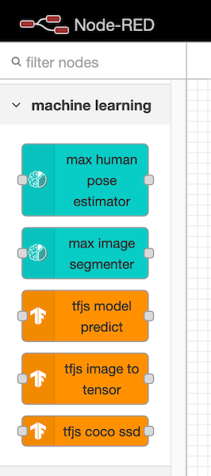

```diff
- WORK IN PROGRESS
```

# Node-RED Nodes for Machine Learning with TensorFlow.js

This repository is a collection of Node-RED nodes and flows that use TensorFlow.js to enable Machine Learning in Node-RED.



## Resources

- [Node-RED](https://nodered.org/)
- [TensorFlow.js](https://www.tensorflow.org/js/)
- [TensorFlow.js and Node-RED](https://ibm.biz/tfjs-nodered)
