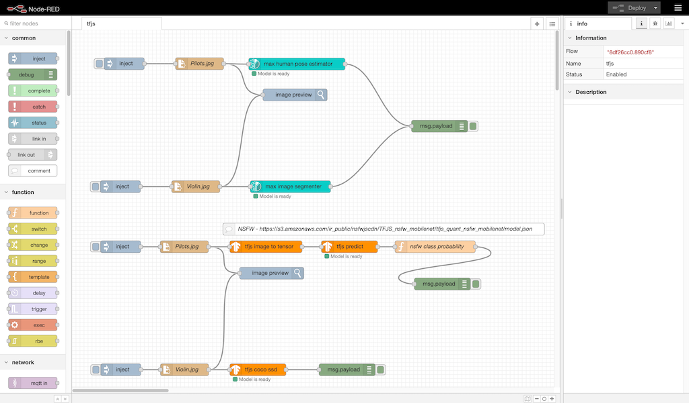

# Sample Flows

## Prerequisite

Install all the modules (i.e., `node-red-contrib-*`) from this repository into your Node-RED deployment.

In addition, the sample flows make use of the `image` preview node. You will need to install the `node-red-contrib-image-output` module to make the `image` node available.

## Import

To import the sample flows:

1. Open the Node-RED editor in your browser
1. Click on the Node-RED Menu
1. Click on **Import**
1. Select the **Clipboard** tab
1. Click on **select a file to import**
1. Browse to and select the `flows.json` file
1. Select **Import to new flow**
1. Click **Import**

Your workspace should now include a new flow titled **tfjs**. The flow makes use of the 

## Run

To run the flows you will need to update some of the nodes according to your environment:

- Update all `file in` nodes so the **Filename** property corresponds to the full path of an image on your machine

